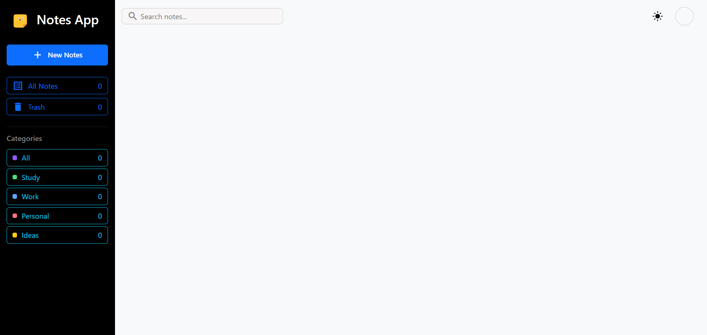
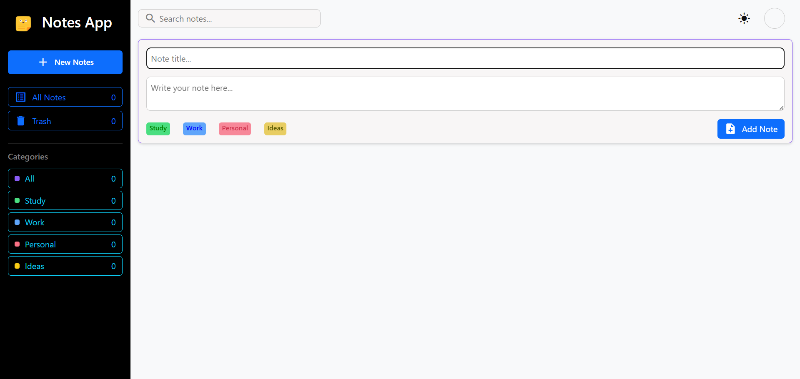

# 📝 Notes App

A modern and user-friendly Notes App built using **HTML, CSS, and JavaScript**. This application allows users to create, organize, edit, and manage notes efficiently with category-based tags, automatic timestamps, and dark mode support.

## 🚀 Live Demo

https://sakib-raza-code.github.io/notes-app/

## 🚀 Features

- Create notes with a title and description
- Automatically stores the date and time of note creation
- Organize notes using tags:
  - 📚 Study
  - 💼 Work
  - 👤 Personal
  - 💡 Ideas
- Dynamic note colors based on selected category
- Edit existing notes
- Delete notes
- Dark mode / Light mode toggle
- Category-wise note counters
- Clean and user-friendly interface

## 🛠️ Technologies Used

- HTML
- CSS
- JavaScript (Vanilla JS)

## 📂 Project Structure

```text
Notes-App/
│
├── index.html
├── style.css
├── script.js
├── assets/
│
└── screenshot.png
```

## Preview

### Main Interface


### Creating a Note


## 🎯 How to Use

1. Click the **New Notes** button.
2. Enter a note title.
3. Write your note content.
4. Select a category tag.
5. Click **Add Note**.
6. The note will be displayed with:
   - Selected category color
   - Creation date and time
7. Use the edit icon to update a note.
8. Use the delete icon to remove a note.

## 📊 Categories

The application supports four categories:

| Category | Purpose |
|----------|----------|
| Study    | Educational notes |
| Work     | Work-related tasks |
| Personal | Personal reminders |
| Ideas    | Quick ideas and thoughts |

Each category maintains its own note counter.

## 🔮 Future Improvements

- Search functionality
- Trash / Recycle Bin
- Filter notes by category
- Sort notes by creation date
- Export notes
- Import notes
- Pin important notes

## 📚 What I Learned

While building this project, I practiced:

- HTML page structure
- CSS styling
- CSS Flexbox and Grid layouts
- JavaScript Functions
- DOM Manipulation
- Event Handling
- Dynamic UI Updates
- Theme Switching (Dark Mode)
- JavaScript Date and Time
- Working with user input
- Building a complete project from scratch

## 👨‍💻 Author

**Sakib Raza**

My first JavaScript project built while learning web development.

---

⭐ If you like this project, feel free to give it a star on GitHub.
